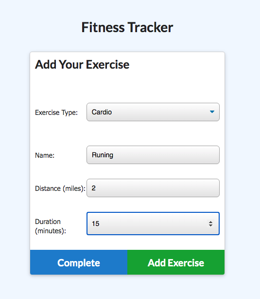

# OH-MY!! Own Workout Tracker


## Description

For this application I created the backend for a workout tracker, as the front end code was provided. I used Mongo for the databse, Mogoose for the schema and Express for the handle routes.

## User Story

```md
As a user, I want to be able to view create and track daily workouts. I want to be able to log multiple exercises in a workout on a given day. I should also be able to track the name, type, weight, sets, reps, and duration of exercise. If the exercise is a cardio exercise, I should be able to track my distance traveled.
```

## Business Context

```md
A consumer will reach their fitness goals more quickly when they track their workout progress.
```

## Table of Content

- [Installation](#installation)

- [Technology](#technology)

- [Usage](#usage)

- [Contributions](#contributions)

- [License](#license)

- [Questions](#questions)

## Installation

_Steps require to install this project and to get the development environment running:_

1. Run the command below in the terminal:

```bash
npm init
```

2. Seed the database by running the command below:

```bash
npm run seed
```

3. To generate the application run the following command in the terminal:

```bash
npm start
```

## Technology

- HTML
- CSS
- JavaScript
- Node.js
- Express.js
- [MongoDB](https://docs.mongodb.com)
- [Mongoose](https://mongoosejs.com/)
- MongoDB Atlas
- Heroku

## Usage

The following is the live link of the application:

[OH-MY!! Own Workout Tracker](https://oh-my-own-workout-tracker.herokuapp.com)

### Function

- When the user loads the page, they are given the option to create a new workout or continue with their last workout.

| Home Page |
| --------- |

|

The user is able to:

- Add exercises to the most recent workout plan by clicking the "Continue Workout" button.

| Continue Workout Screen |
| ----------------------- |



- Add new exercises to a new workout plan by clicking the "New Workout" button.

| New Workout Sreen |
| ----------------- |


- View the combined weight of multiple exercises, and the total duration of each workout from the past seven workouts on the `stats` page.

| Dasboard Screen |
| --------------- |


## Contributions

The following were contributors to this project:

- [Nadia Dorado](https://github.com/ndorado3)
- GT Coding Bootcamp Projects Design Team

## License

MIT

Copyright (c) [2021] [Nadia Dorado]

Permission is hereby granted, free of charge, to any person obtaining a copy of this software and associated documentation files (the "Software"), to deal in the Software without restriction, including without limitation the rights to use, copy, modify, merge, publish, distribute, sublicense, and/or sell copies of the Software, and to permit persons to whom the Software is furnished to do so, subject to the following conditions:

The above copyright notice and this permission notice shall be included in all copies or substantial portions of the Software.

THE SOFTWARE IS PROVIDED "AS IS", WITHOUT WARRANTY OF ANY KIND, EXPRESS OR IMPLIED, INCLUDING BUT NOT LIMITED TO THE WARRANTIES OF MERCHANTABILITY, FITNESS FOR A PARTICULAR PURPOSE AND NONINFRINGEMENT. IN NO EVENT SHALL THE AUTHORS OR COPYRIGHT HOLDERS BE LIABLE FOR ANY CLAIM, DAMAGES OR OTHER LIABILITY, WHETHER IN AN ACTION OF CONTRACT, TORT OR OTHERWISE, ARISING FROM, OUT OF OR IN CONNECTION WITH THE SOFTWARE OR THE USE OR OTHER DEALINGS IN THE SOFTWARE.

## Questions

For questions about this project please contact me:

- Email: nadiadorado@gmail.com
- Github: https://github.com/ndorado3
